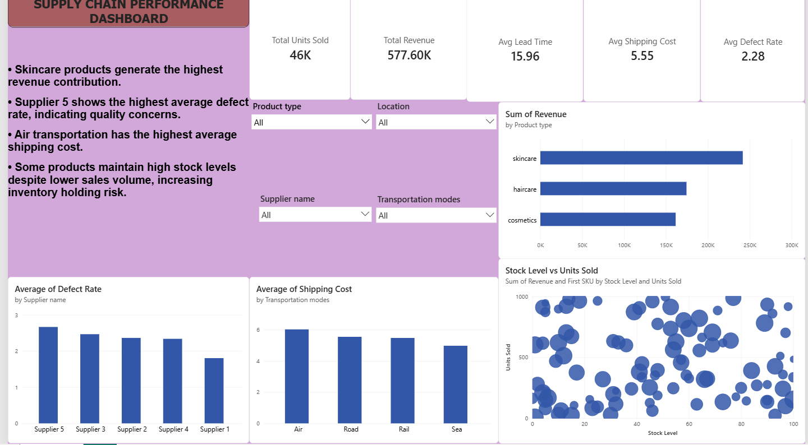

# Supply Chain Dashboard

## Overview
This project is an interactive Supply Chain Analytics Dashboard built using Power BI.

The dashboard provides insights into:
- Inventory Management
- Supplier Performance
- Order Fulfillment
- Shipment Tracking
- Demand Forecasting
- Logistics KPIs

---

## Tools Used
- Power BI
- Excel / CSV
- DAX
- Data Modeling

---

## Key Features
- Real-time KPI monitoring
- Interactive filtering
- Inventory trend analysis
- Supplier efficiency tracking
- Delivery performance metrics

---

## Dashboard Preview

### Overview Page

---

## KPIs Included
- Total Orders
- Delivery Delay %
- Inventory Turnover
- Supplier Lead Time
- On-Time Delivery Rate
- Shipping Cost Analysis

---

## Project Learnings
- Data cleaning and transformation
- DAX calculations
- Dashboard storytelling
- KPI visualization
- Supply chain analytics

---

## Author
Akshat Singhal
